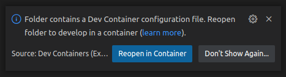
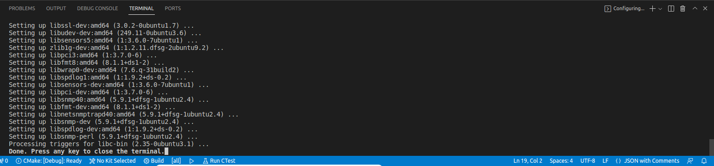
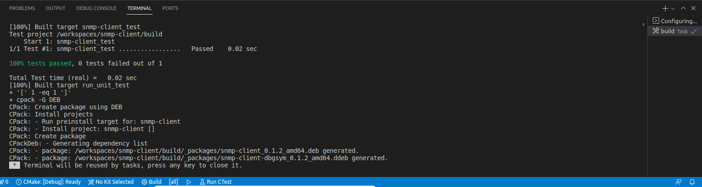

# CARMA Time Library

The CARMA Time Library is a focused library providing classes and utilities which enable a consuming project to synchronize mock time with the CARMA simulation framework.

## CI Status

These badges are for the default branch only.

[](https://github.com/usdot-fhwa-stol/carma-time-lib/actions/workflows/build.yml)
[](https://sonarcloud.io/summary/new_code?id=usdot-fhwa-stol_carma-time-lib)
[](https://sonarcloud.io/summary/new_code?id=usdot-fhwa-stol_carma-time-lib)

## Using the Library

The following sections will describe how to use the CARMA Time Library in your C++ or Python application

### Install library

The easiest way to include the CARMA Time Library in your application is to install it via `apt`.
**Prerequisites**

- Ubuntu ( jammy, focal, bionic )
- CMake 3.10
- Python 3

The CARMA Time library is one the the FHWA (Federal Highway Administration) STOL (Saxton Transportation Operation Library) libraries built into a Debian package via CMake/CPack scripts from the [carma-builds](https://github.com/usdot-fhwa-stol/carma-builds) repository. CI (Continuous Integration) scripts also push this Debian package to a STOL Debian Package repository. To install this package you must only add this repository to `apt`.

```shell
# Get ubuntu distribution code name. All STOL APT debian packages are pushed to S3 bucket based on distribution codename.
. /etc/lsb-release
# add the STOL APT repository
echo "deb [trusted=yes] http://s3.amazonaws.com/stol-apt-repository ${DISTRIB_CODENAME} main" > /etc/apt/sources.list.d/stol-apt-repository.list
apt update
apt install carma-clock-1
```

This steps above add the relavent STOL apt repository for pulling correct debian package.
> [!IMPORTANT]\
>The python bindings for **CARMA Time Lib** are not included by default in the debian package. To install this library for use
with python we suggest you install it locally with the following steps

```shell
./install_dependencies.sh
cmake -Bbuild -DBUILD_PYTHON_BINDINGS=ON .
cmake --build build
```

### Including with CMake (C++)
To find and link this library via CMake the following commands are necessary

```cmake
cmake_minimum_required(VERSION 3.10.2)
...
# This can be set inside CMake files or via argument passed to cmake CLI calls
list(APPEND CMAKE_MODULE_PATH "/opt/carma/cmake")
...
# Find CMake package
find_package(carma-clock REQUIRED)
...
# Link against library
target_link_libraries( ${PROJECT_NAME} PUBLIC
    ::carma-clock

)
```

### Importing as Python Module
> [!IMPORTANT]\
>Python module support is currently only available for x86/amd devices
To import this library as a python module the following is necessary.

```python
# This path can be added via the sys module or by directly appending the PYTHON_PATH environment variable.
import sys
sys.path.append('/path/to/library')
# Import C++ library as python module
import importlib
libcarma_clock = importlib.import_module("libcarma-clock")

...
# Initialize CARMA Clock object
clock = libcarma_clock.CarmaClock(False)

```

## Configuration

The following operating modes are available in the library:
* Real-time
* Simulated time

TODO How the library is configured

TODO Move this configuration logic into a time manager tool in a separate library.
# Architecture

The CarmaClock class contains an internal representation for time which serves as a replacement for the epoch tracked by the system clock, or any other related time-keeping machinery.

This internal time value is stored as a TODO value representing TODO since TODO.

The framework provides the following capabilities:
1. Initialization and update functions which set the internal time representation mode and value.
2. Current time available for query.
3. Time representation available in real-time and simulation mode.
4. The framework falls back to system time if not running in simulation mode.
5. Utility functions.

# Building the Library
## Configuring Build Environment

The project build environment is supplied as a single-image [Docker Dev Environment](https://docs.docker.com/desktop/dev-environments/), with Visual Studio Code editor configurations to enable streamlined setup.

To load the project in VSCode:

1. Clone this repository.

```
git clone git@github.com:usdot-fhwa-stol/carma-time-lib.git
cd carma-time-lib/
```

2. Open the VSCode editor.
3. Open the cloned project folder.
4. Accept the **Reopen in Container** prompt for **"Folder contains a Dev Container configuration file. Reopen folder to develop in a container (learn more)."**



7. If that prompt did not appear, open the **View > Command Palette** and type to locate **"Dev Containers: Rebuild and Reopen in Container"**.
6. The editor should refresh and display the updated activity in the command line.



If the container startup was successful, the development environment is up and running and contains the library dependencies and compilation environment. It is possible to proceed with the build.

## Building

1. In VSCode, open **Build the Terminal > Run Build Task...**.



2. If the build is successful, tests are automatically executed and a Debian package is generated.
3. TODO more details (output product locations, reference information for generalized docker dev solution including container configured locations etc.).

## Additional IDE Configuration

Some additional configurations are provided out-of-the-box to streamline the developer's setup process. These are included for Visual Studio Code:

| Item                                  | Description                                                                                                          |
|---------------------------------------|----------------------------------------------------------------------------------------------------------------------|
| .devcontainer/devcontainer.json       | Docker Dev Environment definition file.                                                                              |  |  |  |
| .editorconfig                         | Some standard, robust VSCode editor configurations.                                                                  |  |  |  |
| .github/workflows/build.yml           | GitHub CI build definition.                                                                                          |  |  |  |
| .github/workflows/sonar-scanner.yml   | TODO                                                                                                                 |  |  |  |
| .gitignore                            | Some helpful Git Ignore rules that should apply to Cmake-based C++ projects developed with most modern code editors. |  |  |  |
| install_dependencies.sh               | Docker Dev Environment internal script. TODO move this file?                                                         |  |  |  |
| .vscode/tasks.json                    | Build task definition utilizing Docker Dev Environment.                                                              |  |  |  |


# CARMA Projects

See all CARMA projects in the [USDOT FHWA STOL](https://github.com/usdot-fhwa-stol) organization on GitHub.

In particular, the CARMA Simulation framework is available [here](https://github.com/usdot-fhwa-stol/carma-simulation).

## Contribution

Welcome to the CARMA contributing guide. Please read this guide to learn about our development process, how to propose pull requests and improvements, and how to build and test your changes to this project. [CARMA Contributing Guide](https://github.com/usdot-fhwa-stol/carma-platform/blob/develop/Contributing.md)

## Code of Conduct

Please read our [CARMA Code of Conduct](https://github.com/usdot-fhwa-stol/carma-platform/blob/develop/Code_of_Conduct.md) which outlines our expectations for participants within the CARMA community, as well as steps to reporting unacceptable behavior. We are committed to providing a welcoming and inspiring community for all and expect our code of conduct to be honored. Anyone who violates this code of conduct may be banned from the community.

## Attribution

The development team would like to acknowledge the people who have made direct contributions to the design and code in this repository. [CARMA Attribution](https://github.com/usdot-fhwa-stol/carma-platform/blob/develop/ATTRIBUTION.md)

## License

By contributing to the Federal Highway Administration (FHWA) Connected Automated Research Mobility Applications (CARMA), you agree that your contributions will be licensed under its Apache License 2.0 license. [CARMA License](https://github.com/usdot-fhwa-stol/carma-platform/blob/develop/docs/License.md)

## Contact

Please click on the CARMA logo below to visit the Federal Highway Adminstration(FHWA) CARMA website.

[](https://highways.dot.gov/research/research-programs/operations/CARMA)
